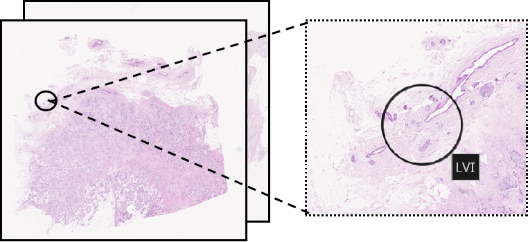

# Identifying lymphovascular invasion in breast cancer by deep learning on histopathological slides
The github repository from master thesis of BINP51

Author: Qianrui Liu

Github Link: https://github.com/QianruiLiu/Master_thesis_LVI_classification

**Workflow overview**
> 0.Environment setup

> 1.Dataset structure and label

> 2.WSI preprocessing

> 3.Tile-level feature extraction

> 4.Model development

> 5.Independent test evaluation

> 6.Robustness analysis across random seeds

> 7.Clinical analysis

*For an easier management of the installed programs and their dependencies, all analyses were performed in a Conda environment.

## 0) Environment setup

In this study, three environments need to be set up. First of all, clone this repository to your computer with

```bash
git clone https://github.com/QianruiLiu/Master_thesis_LVI_classification.git
```

### Gigapath

* **Install gigapath**

Download gigapath repository provided in https://github.com/prov-gigapath/prov-gigapath and open it by

```bash
git clone https://github.com/prov-gigapath/prov-gigapath
cd prov-gigapath
```

* **Build Gigapath environment**

```bash
conda env create -f ../Master_thesis_LVI_classification/envs/gigapath.yml
conda activate gigapath
pip install -e .  # Install the local GigaPath repository as an editable Python package
```

  *Notice: All the scripts in model/gigapath should be run in this environment
  
### CLAM

```bash
cd ~/Master_thesis_LVI_classification
conda env create -f envs/clam.yml
conda activate clam_latest
```

The original CLAM repository can be found in https://github.com/mahmoodlab/CLAM.git.

  *Notice: All the scripts in model/CLAM should be run in this environment

### Survival_analysis

```bash
cd ~/Master_thesis_LVI_classification
conda env create -f envs/clinical_analysis.yml
conda activate lvi_clinical_analysis
```

  *Notice: All the scripts in clinical_analysis/ should be run in this environment

## 1) Dataset structure and label

### Dataset overview of WSIs
This study based on 488 breast cancer H&E WSIs with slide-level LVI labels. The slides are in `.ndpi` format, each accompanied by an `.ndpa` annotation file containing pathologist-provided LVI-related annotations, such as ROI circles or pins.

The figure shows an example of the slides with ROI circles indicating LVI area：

<p align="center">
  
</p>

### Slide-level LVI labels
* **Pathologist B's slide-level LVI labels** were used as the main ground-truth labels for model training and evaluation.

* **Pathologist A's LVI-positive slides with ROI circle annotations** were used only for ROI-guided sampling during training and for qualitative model interpretation.

### Stratified dataset splitting
Dataset splitting was stratified by the main slide-level LVI ground-truth label, which was divided into a development set and an independent test set at a 2:1 ratio. This can be done by the codes below:

```bash
import pandas as pd
from sklearn.model_selection import train_test_split

# Read file
df = pd.read_csv("LVI_lable.tsv", sep="\t")

# Remove rows without LVI label
df = df.dropna(subset=["LVI"])

# Stratified split by LVI, 2:1 = development : independent test
dev_df, test_df = train_test_split(
    df,
    test_size=1/3,
    stratify=df["LVI"],
    random_state=42
)

# Save files
dev_df.to_csv("labels_development.tsv", sep="\t", index=False)
test_df.to_csv("labels_independent_test.tsv", sep="\t", index=False)
```
The codes should be run in gigapath environment. The paths of files should be the real path in your computer. The example divided labels used in this study can be found in **labels_and_sheets/labels_develop.tsv** and **labels_and_sheets/labels_independent_test.tsv**.

## 2) WSI preprocessing

The WSI preprocessing step tessellates each NDPI WSI into image tiles and saves tile-level metadata for downstream feature extraction.

The preprocessing script is located in:

```baash
models/gigapath/1_preprocessing.py
```
### Example usage:
```bash
conda activate gigapath #The script must be run into gigapath environment

cd ~/Master_thesis_LVI_classification

python models/gigapath/1_preprocessing.py \
      --in-dir /mnt/d/BMM_LVI \ 
      --save-dir /home/student/.cache/outputs/preprocessing \ 
      --level 1 \ 
      --tile-size 1024 

# Arguments
# --in-dir: The directory of your .ndpi files as input
# --save-dir: The output directory
# --level: The tiling level, 1 by default in this study
# --tile-size: The tiling size, 1024 pixel in this study
```
* **Output**

The tile .png figures and dataset.csv for each slides. The expected downstream structure is typically:
> <save_dir>/output/<slide_id>/dataset.csv

> <save_dir>/output/<slide_id>/...tile PNGs

## 3) Tile-level feature extraction

Tile-level embeddings are extracted using the pretrained GigaPath tile encoder. For each slide, the extracted embeddings are saved into one HDF5 file.

The feature extraction script is located in:

```baash
models/gigapath/2_tileencoder_toh5.py
```
### Example usage:
```bash
conda activate gigapath #The script must be run into gigapath environment

cd ~/Master_thesis_LVI_classification

python models/gigapath/2_tileencoder_toh5.py \
       --slides-dir /mnt/d/BMM_LVI \ 
       --tiling-root /home/student/.cache/outputs/preprocessing \  
       --h5-out-root /mnt/d/tile_encoder_h5files \ 
       --level 1 \ 
       --tile-size 1024 \ 
       --batch-size 128 \ 
       --num-workers 4

# Arguments
# --slides-dir: The directory of your source .ndpi files
# --tiling-root: The output directory included all your tiles generated in 2)
# --h5-out-root: The output directory for your .h5 files
# --level: Your tile level, must be consistentt with that in 2)
# --tile-size: Your tile size, must be consistent with that in 2)
# --batch-size: Number of tiles processed at once by the tile encoder
# --num-workers: Number of parallel data-loading workers
```
* **Output**

.h5 files for each slide. The expected downstream structure is typically:
> <h5_out_root>/<slide_id>.tile_embeds.h5

## 4) Model development

### Gigapath

* **Prepare foreground images for heatmap visualization before training**
  
  Before running the training and visualization script `3_development_model_training_5foldCV.py`, foreground images should be extracted from the original `.ndpi` slides using `4_extract_cutting_figures.py`.

  This script generates tissue-containing foreground images after background filtering and before tiling. These images are used as the background canvas for overlaying the feature-importance heatmaps generated during model training/evaluation in `3_development_model_training_5foldCV.py`.

  The preparing script is located in:
  
  ```baash
  models/gigapath/4_extract_cutting_figures.py
  ```
  #### Example usage:

  The script can be directly run by `4.1_run_extract_cutting_figures.sh`. The example shell script can be found in models/gigapath/4.1_run_extract_cutting_figures.sh.
  ```bash
  conda activate gigapath #The script must be run into gigapath environment

  cd ~/Master_thesis_LVI_classification/models/gigapath
  
  #Before running, make sure you have modified `SLIDE_DIR` and `OUT_DIR` in the shell script.
  bash 4.1_run_extract_cutting_figures.sh
  
  # Variables
  # SLIDES_DIR: Directory containing the original .ndpi slides.
  # OUT_DIR: Output directory for all generated figures
  ```
  * **Output**
    For each input slide, the script writes:

    > <slide_id>_roi.png (Foreground ROI crop image)
    
    > <slide_id>_roi_meta.json (Metadata required for coordinate mapping, including origin_x, origin_y, scale, roi_width, and roi_height)
    
* **Gigapath model training with 5-fold CV**

  The model training script is located in:

  ```baash
  models/gigapath/3_development_model_training_5foldCV.py
  ```
  #### Example usage:

  The script can be directly run by `development_training_5_fold_CV.sh`. The example shell script can be found in models/gigapath/run_training_scripts/development_training_5_fold_CV.sh.
  ```bash
  conda activate gigapath #The script must be run into gigapath environment

  cd ~/Master_thesis_LVI_classification/models/gigapath

  #Before running, make sure you have modified all the variables according to your own path
  bash run_training_scripts/development_training_5_fold_CV.sh

  # Variables
  # SLIDES_DIR: Directory containing the original .ndpi slides.
  # H5_ROOT: Directory containing tile-embedding .h5 files extracted in 3).
  # LABELS_TSV: TSV file containing slide IDs and LVI labels, can be found in labels_and_sheets/labels_develop.tsv
  # BASE_OUT: Base output directory for this run.
  # SEED: Random seed used in the experiment.
  # OUT_DIR: Specific output directory name for this hyperparameter/sampling setting.

  # Arguments
  # --slides_dir: Directory containing the source .ndpi slide files.
  # --h5_root: Directory containing tile-embedding .h5 files extracted in 3).
  # --labels_tsv: TSV file containing slide IDs and LVI labels, can be found in labels_and_sheets/labels_develop.tsv
  # --out_dir: Output directory for model checkpoints, prediction files, metrics, ROC curves, and optional heatmaps.
  # --cv_folds: Number of stratified cross-validation folds, 5 in this study.
  # --cv_val_frac: Fraction of the training pool used as the early-stopping validation subset within each CV fold. 15 in this study.
  # --k_max: Maximum number of tile embeddings sampled from each slide.
  # --tile_size: Tile size used during preprocessing. This must be consistent with the preprocessing and tile-embedding extraction steps.
  # --margin_px: Margin size used when mapping tile/block coordinates for visualization.
  # --epochs: Maximum number of training epochs.
  # --patience: Early-stopping patience. Training stops if validation AUC does not improve for this number of epochs.
  # --grad_accum: Number of slides used for gradient accumulation before each optimizer update.
  # --lr_head: Learning rate for the trainable linear classification head.
  # --weight_decay: Weight decay used by the AdamW optimizer.
  # --use_pos_weight: Use positive-class weighting in BCEWithLogitsLoss to account for class imbalance.
  # --seed: Random seed for data splitting, tile sampling, and model training.
  # --roi_inside_cap: Maximum number of inside-ROI tiles preferentially sampled from ROI-positive LVI-positive slides during training.
  # --make_heatmaps: Enable occlusion-based heatmap generation after model evaluation.
  # --heatmap_split test: Dataset split used for heatmap generation. Here, heatmaps are generated from the held-out CV evaluation split.
  # --heatmap_block_px: Spatial block size, in slide pixel coordinates, used for block-level occlusion.
  # --heatmap_thumb_max_px: Maximum size of the thumbnail image used for heatmap visualization.
  # --roi_png_dir: Directory containing foreground ROI images generated by 4_extract_cutting_figures.py. These images are used as the background for heatmap overlay.
  ```
  This script performs GigaPath-based slide-level LVI model development. It loads pre-extracted tile embeddings, trains a linear classification head on top of a frozen GigaPath slide encoder, applies early stopping and threshold selection based on early-stopping set, evaluates held-out  set performance, and optionally generates occlusion-based heatmaps for model interpretation.
  
  * **Output**
    
    > out_dir/fold_XX/{tb, best.pt, config.json, fold_metrics.json} + out_dir/cv_summary.json
    
    > 5_fold CV ROC curve
    
    > feature-importance heatmaps for selected TP, FP, TN, and FN examples (if --make heatmaps)
    
 * **hyperparameter tuning**
   
   In this study, three types of hyperparameters including `k_max`, `lr_head`, `weight_decay` were tuned.
   
   The example hyperparameter tuning shell script can be found in models/gigapath/run_training_scripts/parameters_tuning.sh.
   ```bash
   conda activate gigapath #The script must be run into gigapath environment

   cd ~/Master_thesis_LVI_classification/models/gigapath

   #Before running, make sure you have modified all the variables according to your own path
   bash run_training_scripts/parameters_tuning.sh
   ```

### CLAM baseline comparison

CLAM was used as a weakly supervised multiple-instance learning baseline during model development.

The CLAM-related files are located in
```bash
models/CLAM
```
Before running all of the scripts, make sure you activate CLAM conda environment and step into CLAM folder.

```bash
conda activate clam_latest #The scripst must be run into clam_latest environment

cd ~/Master_thesis_LVI_classification/models/CLAM
```
* **Convert gigaPath HDF5 feature files into CLAM-compatible .pt files** 

  #### Example usage:
  ```bash
  python 1_h52pt.py \
        --h5-root /mnt/d/tile_encoder_h5files \
        --pt-root /mnt/d/CLAM_ptfiles
   
  # Arguments
  # h5-root: The directory of .h5 files generated by gigapath in 3).
  # --save-dir: The output directory containing all .pt files.
  ```
  * **Output**
    
    one CLAM-compatible .pt file per slide:
    
    > <pt-root>/<slide_id>.pt

* **Generating CV splits for CLAM training**
  
  #### Example usage:
  ```bash
  python 2_create_splits_for_CV.py \
        --labels_csv clam_lvi_labels.csv \
        --pt_root /mnt/d/CLAM_data/LVI/pt_files/ \
        --out_dir ./splits \
        --cv_folds 5 \
        --cv_val_frac 0.15 \
        --seed 99 \

  # Arguments
  # --labels_csv: LVI labels of development set for CLAM
  # --pt_root: Directory containing CLAM-compatible .pt files generated in last step
  # --out_dir: Where generated splits file located
  # --cv_folds: Number of CV folds(Same with gigapath)
  # --cv_val_frac: Fraction of the training pool used as the early-stopping validation subset within each CV fold.(Same with gigapath)
  # --seed: Random seed for data splitting
  ```
  * **Output**
 
  > splits_0.csv ... splits_4.csv
  > split_summary.csv

* **CLAM model training with 5-fold CV**

  #### Example usage:
  ```bash
  CUDA_VISIBLE_DEVICES=0 python main.py \
        --drop_out 0.25 \
        --early_stopping \
        --lr 2e-4 \
        --k 5 \
        --exp_code lvi_binary \
        --weighted_sample \
        --bag_loss ce \
        --inst_loss svm \
        --task task_lvi_binary \
        --model_type clam_sb \
        --log_data \
        --data_root_dir /mnt/d/CLAM_data \
        --embed_dim 1536 \
        --split_dir task_lvi_binary_custom5fold \
        --seed 99

  # Arguments
  # CUDA_VISIBLE_DEVICES=0: Use GPU device 0 for CLAM training.
  # --drop_out 0.25: Dropout rate used in the CLAM model to reduce overfitting. This follows the commonly default CLAM setting.
  # --early_stopping: Enable early stopping based on validation performance.
  # --lr: Learning rate for CLAM model training. This follows the commonly used/default CLAM setting.
  # --k: Number of CV folds.
  # --exp_code: Experiment name used for naming output folders and result files.
  # --weighted_sample: Use weighted sampling to reduce the effect of class imbalance during training.
  # --bag_loss: Use cross-entropy loss for slide-level/bag-level classification.
  # --inst_loss: Use SVM-style instance-level loss for CLAM's instance-level clustering branch.
  # --task: Task name defined in the CLAM dataset/task configuration.
  # --model_type: Use the single-branch CLAM model.
  # --log_data: Save training logs for visualization/monitoring.
  # --data_root_dir: Directory containing CLAM-compatible feature files.
  # --embed_dim: Dimension of the input tile embeddings. Here, the embeddings come from the GigaPath tile encoder.
  # --split_dir: Directory containing the custom 5-fold split files.
  # --seed: Random seed used for data splitting/training reproducibility.
  ```
  * **Output**
 
    > summary.csv reporting test_auc and	val_auc for each fold.

* **Generate the mean ROC curve across CLAM CV folds**

    #### Example usage:
  ```bash
  python 3_generate_mean_roc_curve.py \
        --results-dir models/CLAM/results/lvi_binary_s99 \
        --out-path models/CLAM/results/lvi_binary_s99/mean_roc_curve.png \
        --n-folds 5

  # Arguments
  # --results-dir: The result directory of CLAM training.
  # --out-path: Output path of roc curve
  # --n-folds number of folds in CV
  ```
  * **Output**
 
    > ROC curve across 5 folds for CLAM.  
  
## 5) Independent test evaluation

After development-stage model selection, the final GigaPath pipeline was trained on the development set and evaluated on the independent test set.

The final independent test script is located in:

```bash
models/gigapath/5_final_independent_test.py
```
### Example usage:
The script can be directly run by `independent_test_training.sh`. The example shell script can be found in models/gigapath/run_training_scripts/independent_test_training.sh.
```bash
conda activate gigapath #The script must be run into gigapath environment

cd ~/Master_thesis_LVI_classification/models/gigapath

#Before running, make sure you have modified all the variables according to your own path
bash run_training_scripts/independent_test_training.sh

# Variables
# SLIDES_DIR: Directory containing the original .ndpi slide files.
# H5_ROOT: Directory containing tile-embedding .h5 files extracted by 2_tileencoder_toh5.py.
# DEVELOP_TSV: TSV file containing development-set slide IDs and LVI labels. This set is used for final model training, early stopping, and threshold selection.
# EXTERNAL_TSV: TSV file containing independent external test-set slide IDs and LVI labels. This set is used only for final model evaluation.
# BASE_OUT: Base output directory for the final independent test experiment.
# OUT_DIR: Specific output directory for this final model setting and random seed.

# Arguments
# --slides_dir: Directory containing the source .ndpi slide files.
# --h5_root: Directory containing tile-embedding .h5 files extracted by 2_tileencoder_toh5.py.
# --develop_tsv: TSV file containing development-set slide IDs and LVI labels. This set is split into training and early-stopping validation subsets.
# --external_tsv: TSV file containing independent external test-set slide IDs and LVI labels. This set is kept fixed and used only for final evaluation.
# --out_dir: Output directory for model checkpoints, prediction files, selected threshold, metrics, ROC curves, and optional heatmaps.
# --val_frac: Fraction of the development set used as the early-stopping validation subset. Here, 0.2 means 20% of the development set.
# --k_max: Maximum number of tile embeddings sampled from each slide.
# --tile_size: Tile size used during preprocessing. This must be consistent with the preprocessing and tile-embedding extraction steps.
# --margin_px: Margin size used when mapping tile/block coordinates for visualization.
# --roi_inside_cap: Maximum number of inside-ROI tiles preferentially sampled from ROI-positive LVI-positive slides during training.
# --epochs: Maximum number of training epochs.
# --patience: Early-stopping patience. Training stops if validation AUC does not improve for this number of epochs.
# --grad_accum: Number of slides used for gradient accumulation before each optimizer update.
# --lr_head: Learning rate for the trainable linear classification head.
# --weight_decay: Weight decay used by the AdamW optimizer.
# --use_pos_weight: Use positive-class weighting in BCEWithLogitsLoss to account for class imbalance.
# --make_heatmaps: Enable occlusion-based heatmap generation after final model evaluation.
# --heatmap_split: Dataset split used for heatmap generation. Here, "test" means the independent external test set.
# --heatmap_block_px: Spatial block size, in slide pixel coordinates, used for block-level occlusion.
# --heatmap_thumb_max_px: Maximum size of the thumbnail image used for heatmap visualization.
# --roi_png_dir: Directory containing foreground ROI images generated by 4_extract_cutting_figures.py. These images are used as the background for heatmap overlay.
# --seed: Random seed for development/validation splitting, tile sampling, and model training.
# Notice: All parameters are fixed after model development part.
```
* **Output**

  > out_dir/{tb, best.pt, config.json, final_metrics.json}

  > feature-importance heatmaps for selected TP, FP, TN, and FN examples
  
  > independent_test_roc_curve

## 6) Robustness analysis across random seeds

To evaluate robustness, the complete final training and independent test evaluation procedure was repeated across five random seeds.

The script for generating the average ROC curve across seeds is located in:

```bash
models/gigapath/6_get_average_roc_curve_across_seeds.py
```
### Example usage:

```bash
conda activate gigapath #The script must be run into gigapath environment

cd ~/Master_thesis_LVI_classification

python models/gigapath/6_get_average_roc_curve_across_seeds.py \
      --json-files \
            /mnt/d/runs/final_external_eval/lr3e-3_wd1e-2_k512_seed35/final_metrics.json \
            /mnt/d/runs/final_external_eval/lr3e-3_wd1e-2_k512_seed42/final_metrics.json \
            /mnt/d/runs/final_external_eval/lr3e-3_wd1e-2_k512_seed66/final_metrics.json \
            /mnt/d/runs/final_external_eval/lr3e-3_wd1e-2_k512_seed77/final_metrics.json \
            /mnt/d/runs/final_external_eval/lr3e-3_wd1e-2_k512_seed99/final_metrics.json \
      --out-file /mnt/d/runs/final_external_eval/mean_roc_across_5seeds.png

# Arguments
# --json-files: The output json files after running independent test by 5 different seeds
# --out-file: Output of roc curve across 5 seeds
```
* **Output**
  > ROC curve across 5 random seeds

This analysis was used to quantify variability due to random initialization, development-set re-splitting, and tile sampling. It was not used to select the best seed.

## 7) Clinical analysis

Clinical analyses were performed for:

* Pathologist B-defined LVI label (ground truth label)

* Pathologist A-defined LVI label

* model-predicted LVI group

The scripts are located in:
```bash
clinical_analysis/
```
Before running all of the scripts, make sure you activate conda environment for clinical analysis and step into root folder.

```bash
conda activate lvi_clinical_analysis #The scripst must be run into lvi_clinical_analysis environment

cd ~/Master_thesis_LVI_classification
```

### Ground truth label analysis

* **Survival analysis**
  
  #### Example usage:
  ```bash
  Rscript clinical_analysis/B_label_survival_analysis.R \
        --clin-file labels_and_sheets/BMM_artera_version_3.xlsx \
        --out-dir clinical_analysis/results/B_label_survival_analysis
  
  # Arguments
  # --clin-file: The clinical file containing survival information
  # --out-dir: Output directory
  ```
  * **Output**
    > Kaplan–Meier curves for RFi, DRFi, OS, and BCSS
    
    > Univariable Cox regression results for RFi, DRFi, OS, and BCSS
    
